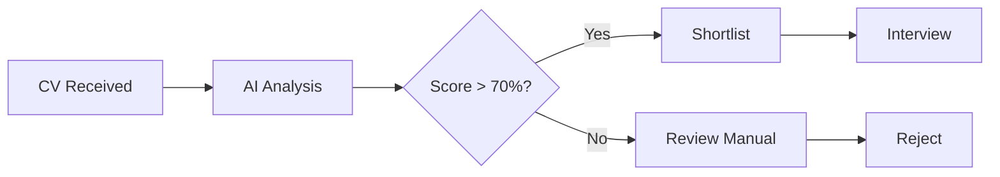

<div align="center">

#  Job Management System with AI-Powered Recruitment

### Intelligent CV Matching • Automated Recruitment • Multi-Role Platform

*Spring Boot • MySQL • AI Integration*

[](https://spring.io/projects/spring-boot)
[](https://openjdk.org/projects/jdk/17/)
[](https://www.mysql.com/)
[](LICENSE)

</div>

---

## 📋 Overview

A comprehensive recruitment management system that leverages AI technology to streamline the hiring process. The platform connects job seekers with employers through intelligent CV matching, automated scoring, and streamlined application workflows.

### Core Intelligence

The AI engine analyzes CV submissions against job requirements, calculating compatibility scores based on:
- **Skill extraction** from CV documents (PDF/DOCX)
- **Requirement parsing** from job postings
- **Experience matching** and **gap analysis**
- **Automated ranking** of candidates by fit percentage

---

##  Architecture

### System Components

```
┌─────────────────────────────────────────────────────────────────┐
│                         PRESENTATION LAYER                      │
│  ┌──────────────┐  ┌──────────────┐  ┌──────────────────────┐  │
│  │   Admin UI   │  │  Employer UI │  │   Candidate UI       │  │
│  └──────────────┘  └──────────────┘  └──────────────────────┘  │
└─────────────────────────────────────────────────────────────────┘
                              ↓
┌─────────────────────────────────────────────────────────────────┐
│                          API LAYER                              │
│  ┌──────────────┐  ┌──────────────┐  ┌──────────────────────┐  │
│  │ REST API     │  │ Auth Service │  │   AI Matching Service│  │
│  └──────────────┘  └──────────────┘  └──────────────────────┘  │
└─────────────────────────────────────────────────────────────────┘
                              ↓
┌─────────────────────────────────────────────────────────────────┐
│                        BUSINESS LAYER                           │
│  ┌──────────────┐  ┌──────────────┐  ┌──────────────────────┐  │
│  │ User Service │  │ Job Service  │  │  Analytics Service   │  │
│  └──────────────┘  └──────────────┘  └──────────────────────┘  │
└─────────────────────────────────────────────────────────────────┘
                              ↓
┌─────────────────────────────────────────────────────────────────┐
│                         DATA LAYER                              │
│  ┌──────────────┐  ┌──────────────┐  ┌──────────────────────┐  │
│  │   MySQL      │  │  Repository  │  │  Entity Models       │  │
│  └──────────────┘  └──────────────┘  └──────────────────────┘  │
└─────────────────────────────────────────────────────────────────┘
```

### Technology Stack

| Category | Technology | Purpose |
|----------|------------|---------|
| **Backend** | Spring Boot 4.1.0 | Application framework |
| **Language** | Java 17 | Core programming language |
| **Database** | MySQL 8.0 | Data persistence |
| **ORM** | Spring Data JPA | Database abstraction |
| **Security** | Spring Security | Authentication & authorization |
| **Template Engine** | Thymeleaf | Server-side rendering |
| **Build Tool** | Maven | Dependency management |
| **Container** | Docker | Database deployment |
| **Database UI** | phpMyAdmin | Database administration |

---

## 👥 User Roles & Features

### 1️⃣ Administrator

**Full system control and oversight**

| Feature | Description |
|---------|-------------|
| **User Management** | CRUD operations for all user types |
| **Employer Management** | Approve/reject employer registrations |
| **Industry Management** | Manage job categories and sectors |
| **Skills Management** | Maintain skill taxonomy |
| **System Analytics** | Dashboard with key metrics |

**Analytics Dashboard:**
```
┌─────────────────┬─────────────────┬─────────────────┐
│ Total Candidates│ CVs Submitted   │ Active Employers│
│     1,247       │      856        │       89        │
└─────────────────┴─────────────────┴─────────────────┘

Top Industries:          Top Skills:
• IT/Software (35%)      • Java (28%)
• Finance (22%)          • Python (24%)
• Healthcare (18%)       • SQL (19%)
```

---

### 2️⃣ Employer

**Job posting and candidate management**

| Feature | Description |
|---------|-------------|
| **Job Creation** | Post positions with detailed requirements |
| **AI Matching** | View compatibility scores for each applicant |
| **Application Review** | Approve/reject with one click |
| **Candidate Sorting** | Filter by score, date, status |
| **Bulk Actions** | Process multiple applications |

**Application Workflow:**


---

### 3️⃣ Candidate (User)

**Profile management and job application**

| Feature | Description |
|---------|-------------|
| **Profile Builder** | Create and update personal profile |
| **CV Upload** | Support PDF/DOCX formats |
| **AI CV Generator** | Auto-create CV from profile data |
| **Job Search** | Browse and apply to positions |
| **Application Tracking** | Monitor application status |
| **AI Feedback** | View matching scores and skill gaps |

**AI CV Generator Process:**
```
Input Profile Data → Template Selection → AI Enhancement
                                          ↓
                        Professional CV + Missing Skills Highlight
```

---

### 4️⃣ AI Engine

**Intelligent matching and analysis**

| Capability | Description |
|------------|-------------|
| **CV Parsing** | Extract skills from uploaded documents |
| **Requirement Analysis** | Parse job posting requirements |
| **Matching Algorithm** | Calculate compatibility percentage |
| **Gap Detection** | Identify missing skills for candidates |
| **Ranking System** | Sort applicants by fit score |

**Matching Algorithm:**
```
Score = (Skill Match × 40%) + (Experience Match × 30%) +
        (Education Match × 20%) + (Keyword Match × 10%)

Skill Gap Analysis:
Present Skills + Required Skills → Gap Report
```

---

## 🚀 Getting Started

### Prerequisites

- **JDK 17+**
- **Maven 3.8+**
- **Docker** (for MySQL)
- **IDE**: IntelliJ IDEA / Eclipse / VS Code

### Installation

**1. Clone Repository**
```bash
git clone https://github.com/Son1BeYew/job-management-system.git
cd job-management-system
```

**2. Start Database**
```bash
docker-compose up -d
```

**3. Configure Application**

Edit `src/main/resources/application.properties` if needed:
```properties
spring.datasource.url=jdbc:mysql://localhost:8085/qltd_db
spring.datasource.username=qltd_user
spring.datasource.password=qltd_pass123
```

**4. Run Application**
```bash
mvn spring-boot:run
```

**5. Access Application**
```
Application:  http://localhost:8083
phpMyAdmin:   http://localhost:8086
```

### Default Credentials

| Role | Email | Password |
|------|-------|----------|
| Admin | admin@careerviet.vn | admin123 |

---

## 📁 Project Structure

```
job-management-system/
├── src/main/java/Nhom08/Project/
│   ├── config/              # Security & web configuration
│   │   └── SecurityConfig.java
│   ├── controller/          # REST & MVC controllers
│   │   ├── AdminController.java
│   │   ├── AuthController.java
│   │   ├── PageController.java
│   │   └── UserController.java
│   ├── dto/                 # Data transfer objects
│   │   ├── LoginDTO.java
│   │   ├── UserRegisterDTO.java
│   │   └── EmployerRegisterStep*.java
│   ├── entity/              # JPA entities
│   │   ├── User.java
│   │   ├── Employer.java
│   │   └── Role.java
│   ├── repository/          # Data access layer
│   ├── service/             # Business logic
│   └── QltdApplication.java # Main entry point
├── src/main/resources/
│   ├── static/              # HTML, CSS, JS, Images
│   ├── templates/           # Thymeleaf templates
│   └── application.properties
├── docker-compose.yml       # Database configuration
└── pom.xml                  # Maven dependencies
```

---

## 🔐 Security

### Authentication Flow

```
┌─────────┐    ┌─────────────┐    ┌──────────────┐
│  User   │───→│  Spring     │───→│  Session     │
│ Request │    │  Security   │    │  Management  │
└─────────┘    └─────────────┘    └──────────────┘
                      ↓
              ┌─────────────┐
              │  Role-Based │
              │  Access     │
              │  Control    │
              └─────────────┘
```

### Access Control

| Endpoint | Admin | Employer | User |
|----------|-------|----------|------|
| `/api/admin/*` | ✅ | ❌ | ❌ |
| `/api/employer/*` | ✅ | ✅ | ❌ |
| `/api/user/*` | ✅ | ✅ | ✅ |

---

## 📊 Database Schema

```sql
-- Core Tables
users          -- User authentication & profile
employers      -- Company information
roles          -- System roles (ADMIN, EMPLOYER, USER)
jobs           -- Job postings
applications   -- Job applications
skills         -- Skill definitions
user_skills    -- User skill associations
job_skills     -- Job skill requirements

-- Relationships
users ──1:1── employers
users ──N:1── roles
jobs ──1:N── applications
users ──1:N── applications
```

---

## 🛠️ API Endpoints

### Authentication

| Method | Endpoint | Description |
|--------|----------|-------------|
| POST | `/api/auth/register/user` | Register candidate |
| POST | `/api/auth/register/employer/step1` | Employer registration (step 1) |
| POST | `/api/auth/register/employer/step2` | Employer registration (step 2) |
| POST | `/api/auth/login` | User login |
| GET | `/api/auth/check-email` | Check email availability |

### Admin

| Method | Endpoint | Description |
|--------|----------|-------------|
| GET | `/api/admin/stats` | Dashboard statistics |

---

## 🔄 Development Workflow

```bash
# Build project
mvn clean package

# Run tests
mvn test

# Start database
docker-compose up -d

# Run application
mvn spring-boot:run

# View logs
docker-compose logs -f mysql
```

---

## 🤝 Contributing

1. Fork the repository
2. Create feature branch (`git checkout -b feature/AmazingFeature`)
3. Commit changes (`git commit -m 'Add some AmazingFeature'`)
4. Push to branch (`git push origin feature/AmazingFeature`)
5. Open Pull Request

---

## 📄 License

This project is licensed under the MIT License.

---

## 👨‍💻 Development Team

**Team 08 (Nhom08)** - Job Management System

*Spring Boot • MySQL • AI-Powered Recruitment*

---

<div align="center">

**Built with ❤️ for smarter hiring**

</div>
